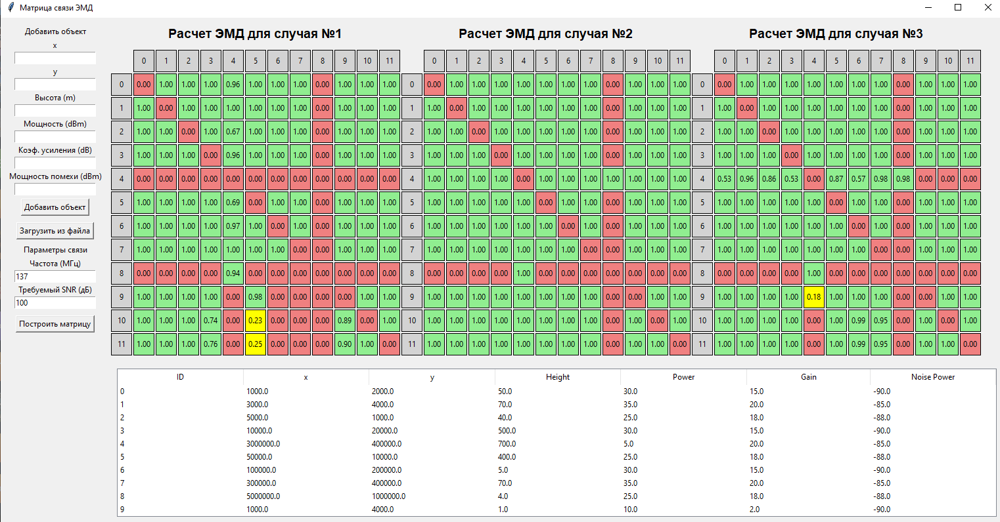

# ЭМД Связь и Моделирование

Этот проект реализует систему для моделирования связи между объектами на основе ЭМД (Электромагнитной Доступности). Программа позволяет строить матрицы связи, рассчитывать отношения сигнал/шум и вероятности связи для различных объектов с учетом их положения, высоты, мощности и других параметров.


## Описание

Программа позволяет моделировать взаимодействие объектов на основе их географического положения и характеристик связи. Расчет основан на таких параметрах, как:
- Высота объектов,
- Мощность сигнала,
- Коэффициент усиления,
- Мощность помехи,
- Частота связи.

Матрицы связи строятся для различных средств связи, и для каждого объекта определяется вероятность связи с другими объектами на основе этих характеристик.

## Основные функции

- **Добавление объектов**: Можно добавлять новые объекты с характеристиками (x, y, высота, мощность и т. д.).
- **Загрузка объектов из CSV файла**: Поддержка загрузки объектов из CSV файла.
- **Расчет ЭМД**: Программа рассчитывает вероятность связи между объектами на основе их характеристик и их удаленности друг от друга.
- **Визуализация матрицы связи**: Система строит и отображает матрицу связи между объектами с визуализацией вероятности связи.

## Установка

1. Клонируйте репозиторий на свою машину:
    ```bash
    git clone https://github.com/ваш-репозиторий/emd-связь.git
    ```

2. Перейдите в папку проекта:
    ```bash
    cd emd-связь
    ```

3. Установите зависимости:
    ```bash
    pip install -r requirements.txt
    ```

4. Убедитесь, что у вас установлен PyInstaller (для создания `.exe` файлов):
    ```bash
    pip install pyinstaller
    ```

## Использование

1. **Запуск программы**: После установки зависимостей, вы можете запустить графический интерфейс программы с помощью:
    ```bash
    python main.py
    ```

2. **Добавление объектов**:
    - Введите параметры (x, y, высота, мощность и т. д.) в соответствующие поля и нажмите "Добавить объект".
    - Также можно загрузить данные объектов из CSV файла с помощью кнопки "Загрузить из файла".

3. **Построение матрицы связи**:
    - Введите параметры частоты и требуемого отношения сигнал/шум, затем нажмите "Построить матрицу". Матрица связи будет отображена в правой части окна.

4. **Экспорт исполнимого файла**:
    - Для создания исполнимого файла `.exe` используйте PyInstaller:
    ```bash
    pyinstaller --onefile --windowed main.py
    ```

## Структура проекта

- `main.py` — основной файл программы с интерфейсом и расчетами.
- `requirements.txt` — файл зависимостей, которые необходимы для работы программы.
- `dist/` — папка, куда будет скомпилирован исполнимый файл `.exe`.
- `build/` — временная папка, используемая PyInstaller для создания `.exe` файла.
- `.gitignore` — файл для исключения папок и файлов, не нужных в репозитории (например, `dist`, `build`).

## Лицензия

Этот проект распространяется под лицензией MIT. См. файл [LICENSE](LICENSE) для подробной информации.
